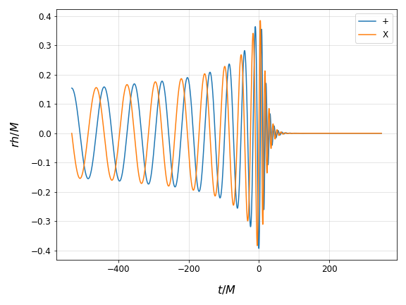

[[Project landing page]](https://sites.google.com/view/waveformtools/home)
[](https://github.com/vaishakp/waveformtools/actions/workflows/ci.yml)
[](https://github.com/vaishakp/waveformtools/blob/main/LICENSE)
[](https://waveformtools.readthedocs.io/en/latest/?badge=latest)
[](https://github.com/psf/black)
[](https://pypi.org/project/waveformtools/)
# Waveformtools 


This is a python module for the handling and analysis of waveforms and data from Numerical Relativity codes, and for carrying out gravitational wave data analysis.  

waveformtools is a numerical relativity data handling package that was written to aid the handling and analysis of numerical relativity data.

This package contains implementations of customized algorithms and techniques.  Some of these contain the usage of existing python based library functions from pycbc, scipy, etc but effort has been made to keep these to a minimum.

  
* Handling of numerical relativity data, and retreiving specific information about the physical system. Presently, this supports the EinsteinToolkit data.

    The class container and methods "sim" can load NR data into convenient lists and dictionaries, which can be used to     retrieve specific data/ information about the numerical simulation. 

    This offers the following functionality, like retreiving:

    * Horizon masses, mass-ratios, and areas.

    * Horizon multipole moments.

    * Merger time/ formation time of common horizon.

    * The strain waveform.

    * The shear data of the dynamical horizons.

	* And computing/ extracting the Frequency, amplitude and phase of waveforms, etc.

* Handling of waveforms.

    A  basic class container for handling numerical waveforms. 

    This offers functionality like:

    * loading data from hdf5 files.

    * basic information such as time step, time axis, data axis, etc.

    * extrapolating a numerical waveform recorded at a finite radius to null infinity (to be added soon).

    * integrating and differentiating waveforms in the frequency domain (to be added soon). 


* Tools for preparation/handling of numerical relativity data, like:

    * checking for discontinuity, removal of duplicated rows, and interpolating for missing rows in the data.

    * integration, differentiation of numerical data.

    * equalizing lengths of waveforms.

    * resampling

    * computing the norm, shifting/ rolling the data, etc.

    * Smoothening, tapering.

    * Extrapolation of waveforms to null infinity.

    * Center of Mass corrections to waveforms.

    * BMS Supertranslations of waveforms.


* Tools for basic data analysis.

    * A match algorithms for matching two waveforms.

    * Binning and interpolation of data. 

    * Smooth derivatives: spectral and finite difference derivatives.

* Miscellaneous tools:

    * Progress bar to display progress of loops.

    * A custom print function with message prioritization.

    * Saving data to disk with protocol support (binary, text, etc.)   


# Citing this code

Please cite the latest version of this code if used in your work. This code was developed for use in the following works:

1. [News from Horizons in Binary Black Hole Mergers](https://journals.aps.org/prl/abstract/10.1103/PhysRevLett.125.121101)
2. [Tidal deformation of dynamical horizons in binary black hole mergers](https://journals.aps.org/prd/abstract/10.1103/PhysRevD.105.044019)

We request you to also cite these. Thanks!


# Installing this package

## Dependencies

This module has the following dependencies:

* Standard packages (come with full anaconda installation)
    * [`numpy`](http://www.numpy.org/)
    * [`scipy`](http://scipy.org/)
    * [`statistics`](https://docs.python.org/3/library/statistics.html)
    * [`matplotlib`](http://matplotlib.org/)
    * [`h5py`](http://www.h5py.org/)
    * [`termcolor`](https://pypi.org/project/termcolor/)
    * 
* Optional dependencies (labelled [EXT])
    * For use with PyCBC data analysis packages.
        * [`pyCBC`](https://pycbc.org/)
        * [`lalsuite`](https://git.ligo.org/lscsoft/lalsuite)
        * [`ligo-common`](https://git.ligo.org/lscsoft/ligo-common)
    * [`gmpy2`](https://gmpy2.readthedocs.io/en/latest/)


## Recommended method

I recommend installing this module through pypi:
```sh
pip install waveformtools
```
## Alternate method

Manual install directly from GitHub:

```sh
pip install git+https://github.com/vaishakp/waveformtools@main
```

Or from a clone:

* First, clone this repository:
```sh
git clone https://github.com/vaishakp/waveformtools.git

```
* Second, run python setup from the `waveformtools` directory:
```sh
cd waveformtools
python setup.py install --prefix="<path to your preferred installation dir>"
``` 

## Manually setup conda environment

* To create an environment with automatic dependency resolution and activate it, run
```sh
conda create env -f docs/environment.yml
conda activate wftools
```


# Using this code
```
>>> from waveformtools.waveforms import modes_array
>>> fdir = "<path to data dir>"
>>> fname = 'ExtrapStrain_RIT-BBH-0001-n100.h5'
>>> wf1 = modes_array(label='RIT001', spin_weight=-2)
>>> wf1.file_name = fname
>>> wf1.data_dir = fdir
>>> wf1.load_modes(ftype='RIT', var_type='Strain', ell_max='auto', resam_type='auto')
>>> wf1.get_metadata()
{'label': 'RIT001',
 'data_dir': '/home/vaishakprasad/Downloads/',
 'file_name': 'ExtrapStrain_RIT-BBH-0001-n100.h5',
 'key_format': None,
 'ell_max': 4,
 'modes_list': [[2, [-2, -1, 0, 1, 2]],
  [3, [-3, -2, -1, 0, 1, 2, 3]],
  [4, [-4, -3, -2, -1, 0, 1, 2, 3, 4]]],
 'r_ext': 500,
 'frequency_axis': None,
 'out_file_name': None,
 'maxtime': None,
 'date': '2023-04-26',
 'time': '17:37:20',
 'key_ex': None,
 'spin_weight': -2}
```

To access the individual modes, use the :math:`\ell, m` notation.
```
>>> ell = 2
>>> emm = 2
>>> wf1.mode(ell, emm)
array([-5.82188926e-17-2.09534621e-18j, -5.96136537e-17-2.06759459e-18j,
       -6.10007697e-17-2.04743540e-18j, ...,
       -7.23538504e-18+4.65415462e-33j, -3.62788145e-18-4.11078069e-33j,
        0.00000000e+00+0.00000000e+00j])
```

To plot the modes
```
>>> import matplotlib.pyplot as plt
>>> plt.plot(wf1.time_axis, wf1.mode(ell, emm).real, label='+')
>>> plt.plot(wf1.time_axis, wf1.mode(ell, emm).imag, label='X')
>>> plt.legend()
>>> plt.grid(alpha=0.4)
>>> plt.xlabel(r'$t/M$')
>>> plt.ylabel(f'$rh/M$')
>>> plt.show()
```
{: .shadow}

# LAL mode storage conventions and `load_lal_modes_to_modes_array`

This section documents how waveformtools stores LAL time-domain and
frequency-domain modes, how that representation differs from the raw LAL
output, and what limitations apply when using FD modes for matched filtering.

## Two-sided frequency axis

LAL's `SimInspiralChooseFDModes` returns a `SphHarmFrequencySeries` whose
underlying `fdata` axis is **two-sided and sorted**: it runs from
`-f_max` up through 0 to `+f_max`.  With default parameters this produces
an array of `N = 2*ceil(f_upper/delta_f) + 1` bins.

For IMRPhenomXPHM (and other FD approximants):

- **Positive-m modes** (e.g., (l=2, m=2)) carry physical content at
  **negative frequencies** in this sorted representation.
- **Negative-m modes** (e.g., (l=2, m=−2)) carry physical content at
  **positive frequencies**.

Both start from `f_lower` (e.g., 20 Hz), not from `2×f_ISCO`.  The
placement is a consequence of the GW convention for the two-sided spectrum,
not a model-domain cutoff.

Empirical check for M=75 M☉, f_lower=20 Hz (Schwarzschild 2×f_ISCO ≈ 59 Hz):

```
(2,  2) first nonzero frequency: −20 Hz    ← positive-m, negative-freq side
(2, −2) first nonzero frequency: +20 Hz    ← negative-m, positive-freq side
(3,  3) first nonzero frequency: −20 Hz
(4,  4) first nonzero frequency: −20 Hz
```

## `load_lal_modes_to_modes_array` storage

`waveformtools.waveformtools.load_lal_modes_to_modes_array(lal_modes, ...)` iterates
the raw linked-list of modes (both positive and negative m for each ℓ).

For time-domain LAL modes it stores

```python
stored_td[l, m](t) = np.conjugate(mode.data.data)
```

For frequency-domain LAL modes it stores

```python
stored_fd[l, m](f) = (1/N) * np.conjugate(mode.data.data)
```

where `mode.data.data` is the full `N`-element two-sided FD array.  Key points:

- **All modes are stored**, including negative m.  Calling code must sum over
  both signs of m to reconstruct the strain.
- **A conjugate is taken for both TD and FD LAL modes**.  This flips the sign
  of the imaginary part relative to the raw LAL output.
- **A factor `1/N` normalisation is applied only to FD modes**.  This cancels
  the implicit `N` from an IFFT if you want time-domain modes, but must be
  accounted for if you use the stored modes in a purely frequency-domain
  context.

For FD approximants such as IMRPhenomXPHM, `get_td_waveform_modes()` routes
through `get_fd_waveform_modes_as_td()`.  That path recovers the raw LAL FD
samples as `conj(stored_fd) * N`, applies a direct inverse FFT, and conjugates
the TD result so the final object follows waveformtools' TD mode convention.

## `ModesArray.evaluate_angular(theta, phi)`

Reconstructs the strain at orientation `(θ, φ)` via

```
h(f; θ, φ) = Σ_{l,m} stored[l,m](f) · ₋₂Y_{lm}(θ, φ)
```

summed over **all** stored (l, m) pairs (positive and negative m).  The
two-sided frequency axis is preserved; the caller is responsible for
extracting the desired frequency range.

## Comparison with `SphHarmFrequencySeriesGetMode`

LAL's `SphHarmFrequencySeriesGetMode(hlms, l, m)` is a helper that extracts a
single mode and returns a `COMPLEX16FrequencySeries` on the **standard f≥0 LAL
grid** (bin k → k·Δf).  For positive-m modes (e.g., (2,2)), whose physical
content sits at negative frequencies in the two-sided sorted representation,
this standard-grid extraction can return only the positive-frequency tail.  In
practice this can look like the mode starts near the merger/ringdown region
(often around `2×f_ISCO`, depending on the system and model) even though the
underlying two-sided linked-list data contain the inspiral from `f_lower`.

Code that uses `SphHarmFrequencySeriesGetMode` directly (e.g.,
`paralleltempatebank.waveform.generate_waveform_modes`) can therefore obtain
positive-m FD modes that miss the inspiral even though the underlying waveform
covers the full range from `f_lower`.  Using `load_lal_modes_to_modes_array` +
the raw linked list (as waveformtools does) captures the full two-sided
frequency range.

## Summary table

| Approach | Frequency range | Negative-m modes | Normalisation |
|---|---|---|---|
| `SphHarmFrequencySeriesGetMode(hlms, l, m)` | nonnegative-frequency helper grid; may miss positive-m inspiral content | separate call | raw LAL units |
| `load_lal_modes_to_modes_array(..., domain="td")` | LAL TD linked-list time axis | included automatically | conjugate |
| `load_lal_modes_to_modes_array(..., domain="fd")` | two-sided linked-list axis, f_lower to f_upper support | included automatically | conjugate, scaled by 1/N |

---

# Documentation

The documentation for this module is available at [Link to the Documentation](https://waveformtools.readthedocs.io/en/latest/). This was built automatically using Read the Docs.

In some cases where the CI service is unavailable or quota-limited, the documentation may not be automatically built. In such cases, we request the user to access the documentation through the `index.html` file in `docs` directory.


# Bug tracker
If you run into any issues while using this package, please report the issue on the [issue tracker](https://github.com/vaishakp/waveformtools/issues).

  
# Acknowledgements

This project was originally hosted on GitLab and is now developed on GitHub. Several CI and deployment tools are used for testing, version control, and releases.

The work of this was developed in aiding my PhD work at Inter-University Centre for Astronomy and Astrophysics (IUCAA, Pune, India)](https://www.iucaa.in/). The PhD is in part supported by the [Shyama Prasad Nukherjee Fellowship](https://csirhrdg.res.in/Home/Index/1/Default/2006/59) awarded to me by the [Council of Scientific and Industrial Research (CSIR, India)](https://csirhrdg.res.in/). Resources of the [Inter-University Centre for Astronomy and Astrophysics (IUCAA, Pune, India)](https://www.iucaa.in/) were are used in part.
